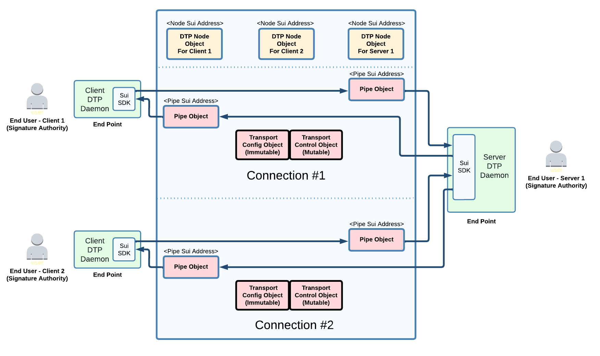

# Architecture

**Should you read the architecture document?**

Developers should start with the API documentation of the SDK, and come to this document only if curious on the inner workings.

This architecture document is intended to coordinate among developers modifying DTP itself.

### DTP Connection Types

At functional level, DTP is similar to TCP but differ significantly in its implementation to benefit from what is already provided by the L1 network.

There are mainly two type of DTP connections:

* Bidirectional : Connection-oriented (like TCP).
* Unidirectional: Connectionless (like UDP)

DTP data is transmitted using Sui transactions (instead of "packets").

### DTP Address

The typical \<IP address>:\<Port> becomes a \<Node Sui Address>:\<Protocol Sui address>\
\
Anyone can create a new "protocol port".\
\
To user, DTP address could look like "acme.com:80", "myradio:channel\_6"\

DNS is provided for both Node and Protocol portion of a DTP address (a node can choose to designate a default protocol in DNS).\
\
Most standard IP service name and protocol port less than 65536 are reserved to minimize confusion ( [IANA- Service Name and Transport Protocol Port Registry](https://www.iana.org/assignments/service-names-port-numbers/service-names-port-numbers.xhtml) )\

### Terminologies

**Objects:** Usually refer to on-chain Sui objects ( See [Sui Docs](https://docs.sui.io/build/programming-with-objects) )\
\
**End-User**: A signature authority that can send/receive data.

**Connection:** One connection allows to exchange data between two end-users. Can be simplex or duplex. A end-user can create a connection by calling a function of the peer DTP Node object (TBD Connection API).\
\
**End-Point**: An off-chain process that can receive data from other end-points. An end point can handle multiple local end users, protocols and connections simultaneously (each independently encrypted).

**Node Object**: Any end-user that want to receive or send data must create its own Node object. The node object is configured to allow/block the services that your app needs. Nodes allows others to access and use your services, including returning data in a bi-directional connection.\
Nodes also allow to control the firewall settings.

**Client**: End-point initiating a bi-directional connection with a Node.

**Server**: End-point assigned to respond to client requests.

**Pipe Object**: Exist for every direction of a connection. It is the object used to transfer data after a connection is created. End-points cannot talk to each other directly, they always need to go through a Pipe object. A pipe can from time to time change the endpoint for high-availability or load balancing (if the end-user have configured multiple end-point to its Node). Notice that even if a Pipe can have multiple end-points, they must all be for the same end-user.\

<figure><figcaption>
Example of two connections between 3 end-users
</figcaption></figure>

**Transport Params Object**: Configuration and reference to objects that never changes for the lifetime of a single connection. Created and own by the DTP Node object. \
\
**Transport Control Object**: Variables and state machines that exists and changes for the lifetime of a single connection. Created and own by the DTP Node object.\
\
**Outlet:** Similar to pipe object, but without an endpoint. The output can be consumed by anyone subscribing to the outlet event stream. Only the user with the decryption key will be able to make sense of the data. This will be the basis for broadcast and multicast (more research to be done here about how to mitigate decryption key sharing/piracy).
