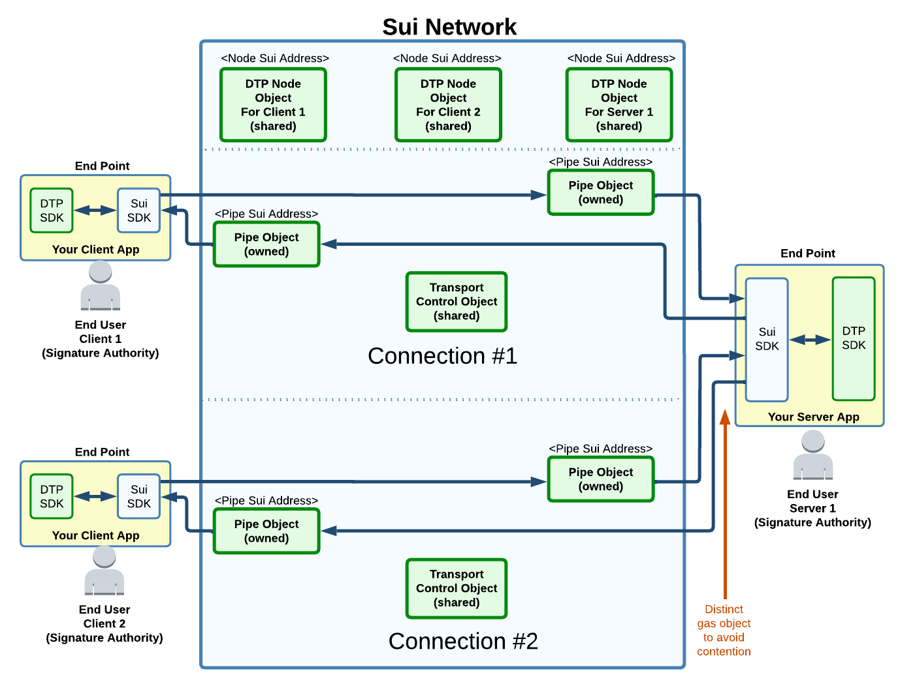
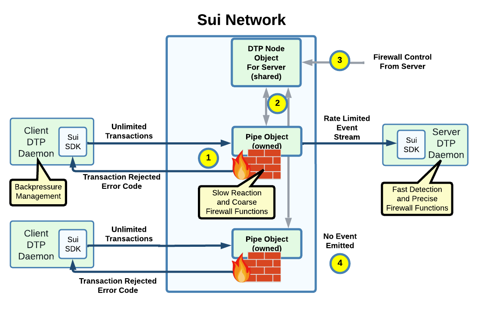
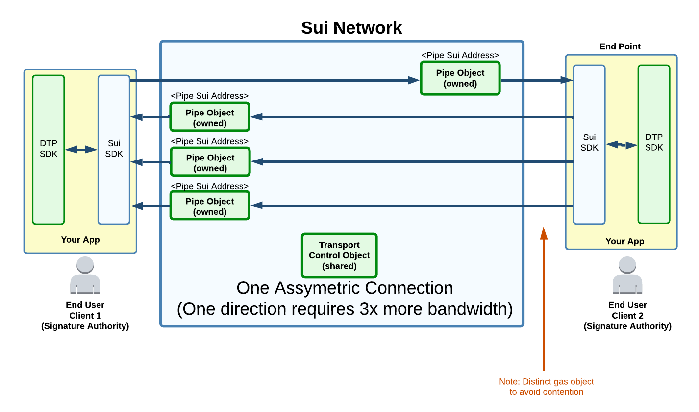
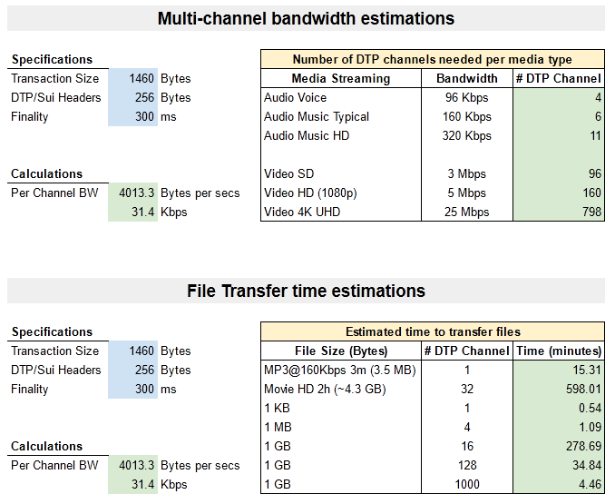
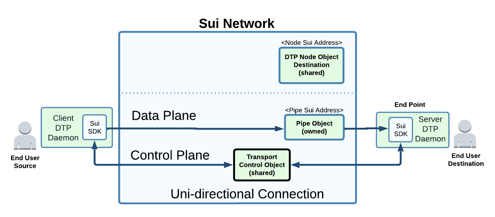

# Architecture

## Target Audience

Developers should first read the SDK documentations for how to use DTP.

This architecture document is intended to coordinate among developers modifying DTP itself.

## DTP Connection Types

At functional level, DTP is similar to TCP but differ significantly in its implementation to benefit from what is already provided by the L1 network.

There are 3 types of data transfer:

* Bidirectional : Connection-oriented (like TCP) between two end-user. Always encrypted.
* Unidirectional: Also connection-oriented between two end-user (for encryption), but heavy data flows only in one direction.
* Public Broadcast: Anyone can receive and observe the authenticated stream of data. This is the only transfer mode without encryption. Requires a different set of object/API calls to avoid accidently broadcasting.

DTP data is originated using Sui transactions.\
The data is received through event streams.\

## DTP Address

The typical \<IP address>:\<Port> becomes a \<Node Sui Address>:\<Port>\
\
There is no DNS as there is no global storage in the Sui network (TODO [SuiNS](https://suins.medium.com/meet-the-sui-name-service-db0792acb117) may be?).

## At high level, how is the Sui Network used?

Sui owned objects are used for unidirectional data transfer with sub-second latency (See [Simple Transaction](https://docs.sui.io/devnet/learn/how-sui-works#simple-transactions) in Sui docs).

Data Ingress: A data stream is sliced into NFTs and added to the Sui network. The creation of the immutable NFTs is done by the destination Pipe.

Data egress: The NFTs exit the network through event streams (emitted by the destination Pipe). This allow for the same NFT to be "observed" by any users, but decoded only by the ones having the decryption key.\
\
The receiving end DTP SDK re-assembles the NFTs into the original data stream. This data is then forwarded to the intended end-user (a TCP server, a Rust application layer above etc...).\
\
Slower transactions (consensus) are used for most "control plane" synchronizations. \

## DTP Glossary

<figure><figcaption>
Example of two connections between 3 end-users
</figcaption></figure>

**Client**: End-point initiating a bi-directional connection with a Node.

**Connection:** One connection allows to exchange data between two end-users. Can be uni or bi-directional. An end-user create a connection by calling a function into the destination DTP Node object program (See [Connection API](dtp-built-in-services/connection-api.md)).

**End-Point**: An off-chain process that can receive data from other end-points. An end point can handle multiple local end users, protocols and connections simultaneously (each independently encrypted).

**End-User**: A signature authority that can send/receive data.

**Node Object**: Any end-user that want to receive or send data must create its own Node object. This is a Sui shared object and involved in many control plane transactions (e.g. creation of a connection). The node allows to manage the services that are to be served, the lifecycle of its associated connections, the management of its end-points. Nodes also control the firewall.\
Nodes are shared Sui object.

**Objects:** Usually refer to on-chain Sui objects ( See [Sui Docs](https://docs.sui.io/build/programming-with-objects) )

**Pipe Object**: End-points can never directly exchange data with each other directly (their IP is not known to the peer). All data plane transfer have to involve a Pipe object on the Sui network. One pipe is required per direction of a connection. A pipe can from time to time change the endpoint for high-availability or load balancing (if the end-user have configured multiple end-point to its Node). Pipe are owned Sui objects (owner is the sender of the data stream).

**Server**: End-point intended to respond to client requests.

**Transport Control Object**: Variables and state machines that exists for the lifetime of a single connection. This is a Sui shared object.

## Firewall

<figure><figcaption>
Built-in Firewall Capabilities
</figcaption></figure>

Firewall main purposes are:

* Protect the receiver by allowing/blocking/limiting new connections depending of the sender address.
* Rate limiting on a per-connection basis. The control is mostly done from the off-chain server, but metering and some limiting is handled on-chain.&#x20;
* On long term considering also on-chain escrow services for service level agreement (SLA) between client and server.
* Protect the sender from initiating/paying for transactions while the server is offline or too busy (backpressure management). This allow the sender to potentially fallback to another server.\

DDoS are unlikely since the burden of gas execution is mostly on the sender. Still a firewall is useful in case of financial attack on the service provider (exploitation of a request cost being low versus the cost of responding).\

Details on the illustration:

(1) Cost of processing incoming traffic is paid by the sender. That includes on connection creation and running the firewall at the Pipe Object. Blocking and some rate limiting can therefore be done without costing anything to the Server.

(2) Optionally, the DTP object can gather statistics from all its Pipe objects and adjust the rate limiting rules. This may happen when the Server detects excessive incoming traffic. The gas cost for these likely rare adjustments are to be handled by the Server. (Note: This is a logical representation. More details will follow on how this is implemented such that Pipe objects are not involved with slower consensus transactions).\
\
(3) The server configure the firewall and does a periodical heartbeat using its shared DTP Node object. The server may also do some fast detection and control on the firewall (TBD).\
\
(4) When a transaction has no-effect because of the firewall, there is no event emitted (and sender is inform that the transaction was executed, but blocked by the firewall). Therefore the Server is not impacted.\
\

## Multi-Channel Connection

Data is transmitted as a stream and therefore must be divided into smaller transactions. Even with a fast finality, the bandwidth is limited by the maximum transaction size.\
\
Multiple simple transaction executed in parallel can provide higher bandwidth for a single connection.\
\
Most of the complexity will be in the off-chain end-points to divide and re-assemble the data stream properly:

<figure><figcaption></figcaption></figure>

**Will this be practical?**\
Keep in mind that DTP primary goal is not for heavy media streaming. Gas might be expensive and there is some potential limitation about how much Sui nodes could scale on a viral broadcast (problem likely at egress of the network, not with the network consensus performance itself).

Still there is value in designing now for multi-channels as it may become useful at some point.  At worst, this will at least allow to demo/stress load on a test network.\
\
Some estimations ( See on [Google Sheet](https://docs.google.com/spreadsheets/d/1zBrB1ifhPpnLlsDr6nBN\_N55Kkw9hX06a7EVUpogyn4/edit?usp=sharing) ):

<figure><figcaption></figcaption></figure>

&#x20;            <mark style="color:red;">(Note: Numbers are best guess as of 11/21/22. Will be revised from time to time)</mark>

## Uni-directional Connection

<figure><figcaption>
Uni-Directional Connection. One direction data plane, but still bi-directional control plane.
</figcaption></figure>

Pipe object are unidirectional for the data transfer (two needed for a bi-directional connection).\
\
Although the data is intended to flow in one direction, some lightweight bi-directional exchanges still happens at various point:\
\
(1) When the connection is created, some bi-directional exchange happen between the source end-point and the destination DTP Node object.\
\
(2) Exchange between end-points through the "Transport Control Object". This relate to encryption protocols (done once or periodic) for ultimately allowing the destination to validate/decode the received data.

(3) Pipe are not **purely** unidirectional. Sender interactions with a Pipe are done with transactions, which means return values allows some responses in failure cases (e.g. the data was immediately dropped by the Pipe because of a receiver firewall rule).

## High-Availability and Load Balancing

<figure><figcaption>
Forwarding decision made by Pipe object when multiple end-points (servers) 
</figcaption></figure>

Off-chain servers can share the incoming load or be each others fallback for high-availability.

Unlike traditional network, the data is not physically pushed toward a server. Instead, the data remains on the network and an event is emitted about who should "pull it".\
\
It is an off-chain responsibility for the DTP daemons to subscribe to their respective event stream (with proper identifier filtering) and normally retrieve only its assigned data (this change in some recovery scenario).\
\
Configuration of the end-points and health of the DTP daemons is managed through the DTP node, which in turn updates all its pipes and transport control objects.\
\
DTP will hide the high complexity of many race conditions (assignment to a server that died) and connection migrations among all its end-points.

## Data Deletion

Once the data is confirmed consumed by the receiver(s), then it can be deleted on the L1 network to recover some storage fee <\<Revisit the design needed here once Sui implements Storage fund>>.\
\
The sender of the data can opt-out from automated deletion and assume the full storage cost.\
\
Automated deletion is controlled by DTP to provide a fair time for the receiver(s) to consume the data and can be fine tuned through the sender service level agreement (SLA).\
\
The SLAs are publish by the server (in its Node object) and one is selected by the client at the time of the connection being established.

## Data Consumption Confirmation

TCP protocol includes acknowledgment of L4 delivery to the destination, but without guarantee of being consumed by the application (requires additional protocol at layer 7). \
\
DTP layer supports both; a confirmation of the data being available on the L1 network (TCP delivery equivalent) and optional confirmation of the client consuming the data (L7 protocol equivalent).\
\
Example of use would be to integrate in the dApps the verification that the data was persisted off-chain by the destination. There is no verification that the destination is honest, but this would be used in context where it would be in the destination best interest to act honestly.\
\
Another benefit for data confirmation is to shorten the time that the data need to be preserved on the network, therefore saving storage fee for the sender. \
\
The "consumed state" is controlled by the receiving application above DTP (the app call a function in the SDK to confirm consumption).\
\
In some use case, the sender may choose to stop transferring further data until the receiver confirm consuming some of the oldest data, therefore motivating the receiver to remain honest. All this will be done under the supervision of DTP for honest handling of the connection service level agreement (SLA).

## Public Broadcasting

Similar to unidirectional, but without encryption and using Broadcast objects instead of a Pipe and Transport control.

<figure><figcaption>
Broadcasting Specific Objects
</figcaption></figure>

The broadcast control implements some related crypto-economic feature. Examples:

* A broadcaster has to pay for the gas fee and storage, which is wasteful if there is no one listening... one option will be to let DTP stop the writing of the stream on the network until there are enough fund from enough listeners willing to cover, say, the cost of the next 1 minute. DTP handles the automatic "on air" logic and fairly spread the cost among the contributors.
* Listener may choose to tip and message a live talking broadcaster for a special request.

There are some technical challenges particular to broadcasting (See [Future Work](future-work.md#broadcasting-challenges)).\

****
