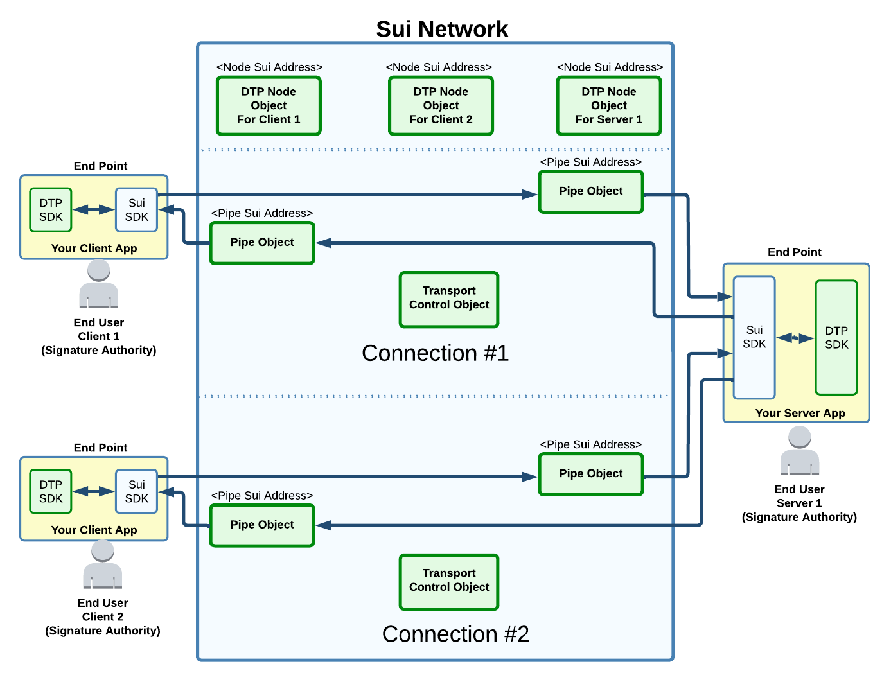
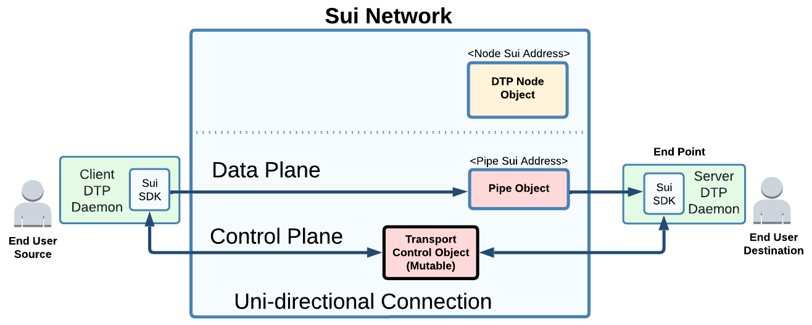

# Architecture

## **Should you read about the architecture?**

Developers should start with the API documentation of the SDK, and come to this document only if curious on the inner workings.

This architecture document is intended to coordinate among developers modifying DTP itself.

## DTP Connection Types

At functional level, DTP is similar to TCP but differ significantly in its implementation to benefit from what is already provided by the L1 network.

There are mainly two type of DTP connections:

* Bidirectional : Connection-oriented (like TCP)
* Unidirectional: Also connection-oriented (e.g. for encryption), but heavy data can flow only in one direction.

DTP data is originated using Sui transactions.\
The data is received through event streams.\

## DTP Address

The typical \<IP address>:\<Port> becomes a \<Node Sui Address>:\<Port>\
\
There is no DNS as there is no global storage in the Sui network (TODO [SuiNS](https://suins.medium.com/meet-the-sui-name-service-db0792acb117) may be?).

## At high level, how is the Sui Network used?

Sui owned objects are used for unidirectional data transfer with sub-second latency (See Simple Transaction in Sui documentation).

Data Ingress: A data stream is sliced into NFT objects added to the network in order.

Data egress: The NFT exits the network through event stream. This allow for the same NFT to be "observed" by any users, but decoded only by the ones having the decryption key.\
\
The receiving end DTP SDK re-assembles the NFT into the original data stream. This data is then forwarded to the intended end-user (a TCP server, a Rust application layer above etc...).\
\
Slower transactions using a mix of Sui shared object and owned objects are involve in light "control plane" synchronizations, but are mostly not used into the heavy "data plane" transfer.

## Terminologies

<figure><figcaption>
Example of two connections between 3 end-users
</figcaption></figure>

**Objects:** Usually refer to on-chain Sui objects ( See [Sui Docs](https://docs.sui.io/build/programming-with-objects) )\
\
**End-User**: A signature authority that can send/receive data.

**Connection:** One connection allows to exchange data between two end-users. Can be uni or bi-directional. An end-user create a connection by calling a function into the destination DTP Node object program (TBD Connection API).\
\
**End-Point**: An off-chain process that can receive data from other end-points. An end point can handle multiple local end users, protocols and connections simultaneously (each independently encrypted).

**Node Object**: Any end-user that want to receive or send data must create its own Node object. This is a Sui shared object and involved in many control plane transactions (e.g. creation of a connection). The node allows to manage the services that are to be served, the lifecycle of its associated connections, the management of its end-points. Nodes also allow to control the firewall settings.

**Client**: End-point initiating a bi-directional connection with a Node.

**Server**: End-point intended to respond to client requests.

**Pipe Object**: End-points can never directly exchange data with each other directly (their IP is not known to the peer). All data plane transfer have to involve a Pipe object on the Sui network. One pipe is required per direction of a connection. A pipe can from time to time change the endpoint for high-availability or load balancing (if the end-user have configured multiple end-point to its Node). \
\
**Transport Control Object**: Variables and state machines that exists for the lifetime of a single connection. This is a Sui shared object. From time to time, it produces "Pipe Control" object that are to be transferred to the owner of a Pipe. This owner uses the "Pipe Control" object for its simple transaction sending data. This is how a slow "control plane" object get to eventually control the fast "data plane" Pipe object. (Side note: the change from one Pipe control to another is deterministically enforced by the Pipe object. The client data plane transactions are rejected until it follow up with the proper next in sequence Pipe Control object).\
\
**Outlet:** Similar to pipe object, but without an endpoint or transport object. Intended for broadcast and multicast application. \

## Firewall

<figure><figcaption>
Built-in Firewall Capabilities
</figcaption></figure>

(1) Cost of processing incoming traffic is paid by the sender. That includes running the firewall logic with the Pipe Object. Filtering and most rate limiting can therefore be done without costing anything to the Server.

(2) Optionally, the DTP object can gather statistics from all its Pipe objects and adjust the rate limiting rules. This may happen when the Server detects excessive incoming traffic. The gas cost for these likely rare adjustments are to be handled by the Server.\
\
(3) The server update the rules with transaction to the DTP Node object. The DTP Node forward these rules to all its Pipes. That may include filtering base on source IP address.\
\
(4) When a transaction has no-effect because of the firewall, there is no event emitted (and origin is inform that the transaction was executed, but blocked by the firewall). Therefore the Server is not impacted.\
\
The design is such that DDoS are unlikely since the burden of gas execution is mostly on the sender.

## Uni-directional Connection

<figure><figcaption>
Uni-Directional Connection. One direction data plane, but still bi-directional control plane.
</figcaption></figure>

Pipe object are unidirectional for the data transfer (two needed for a bi-directional connection).\
\
Although the data is intended to flow in one direction, some lightweight bi-directional exchanges still happens at various point:\
\
(1) When the connection is created, some bi-directional exchange can happen between the source end-point and the destination DTP Node object.\
\
(2) Exchange between end-points through the "Transport Control Object". This relate to encryption protocols (done once or periodic) for ultimately allowing the destination to validate/decode the received data.

(3) Pipe are not **purely** unidirectional. Sender interactions with a Pipe are done with transactions, which means return values allows some responses in failure cases (e.g. the data was immediately dropped by the Pipe because of a receiver firewall rule).

## High-Availability and Load Balancing

<figure><figcaption>
Forwarding decision made by Pipe object when multiple end-points (servers) 
</figcaption></figure>

Off-chain servers can share the incoming load or be each others fallback for high-availability.

Unlike traditional network, the data is not physically forwarded toward a server. Instead, the data remains on the network and an event is emitted about who should "pick it up".\
\
The receiving Pipe object is therefore only responsible to emit an event. It is an off-chain responsibility for the DTP daemons to subscribe to their respective event stream (with proper identifier filtering) and normally retrieve only its assigned data (which is ignored in some recovery scenario).\
\
Configuration of the end-points and liveness of the DTP daemons is managed through the DTP node, which in turn updates all its Pipes/connections for the latest health reports.\
\
DTP will hide the complexity of race conditions (assignment to a server that died). In particular, the Pipe object keeps track if at least one end-points did confirm the consumption of the streamed event.\
\
Once some data is confirmed consumed, the L1 network is no longer responsible for persistence (broadcast/multicast handled differently). Therefore, the end-point should make sure that it is \*completely\* done with the data (or reliably persisted) before confirming its consumption, since DTP does not provide a retry mechanism.\
\
One advantage of DTP compared to TCP, is that the notion of reliable transport can extend at L7 (application level). That is, the application can choose to confirm that the data was more than just transported, but also fully processed.\

## Data Consumption Confirmation

TCP protocol includes acknowledgment of L4 delivery to the destination, but without guarantee of being consumed by the application (requires additional protocol at layer 7). \
\
DTP layer supports both; a confirmation of the data being available on the L1 network (TCP delivery equivalent) and optional confirmation of the client consuming the data (OSI L7 protocol equivalent).\
\
Example of use would be to integrate in the dApps the verification that the data was persisted off-chain by the destination. There is no verification that the destination is honest, but this would be used in context where it would be in the destination best interest to be honest.

## **Broadcasting Encryption**

The broadcasted data can be independently consumed by anyone subscribing to the outlet event stream. Only the user with the decryption key will be able to make sense of the data. The distribution of the decryption key is a responsibility left to the dApps. More research to be done here how DTP could one day mitigate (impossible to eliminate) key sharing/piracy problems \[1]\[2]**.**\
****\
****\[1] Wikipedia [Broadcast Encryption](https://en.wikipedia.org/wiki/Broadcast\_encryption) \
\[2] Wikipedia [Multicast Encryption](https://en.wikipedia.org/wiki/Multicast\_encryption)
