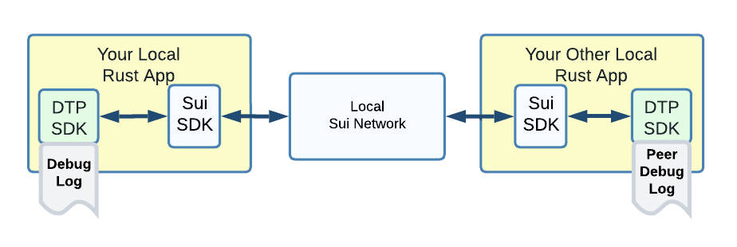
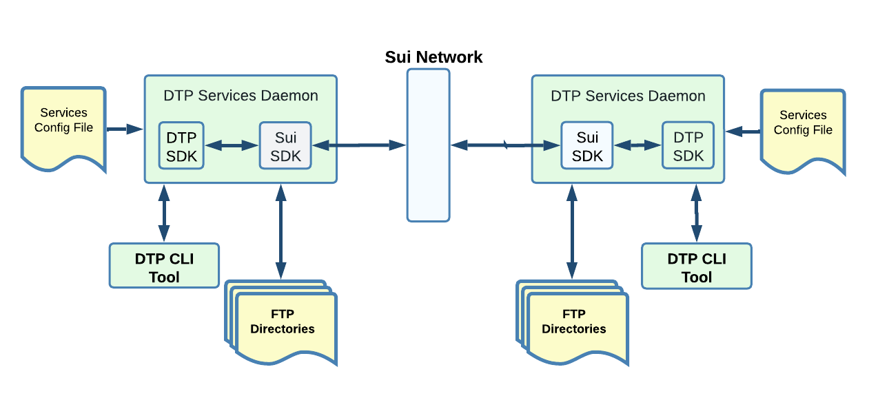
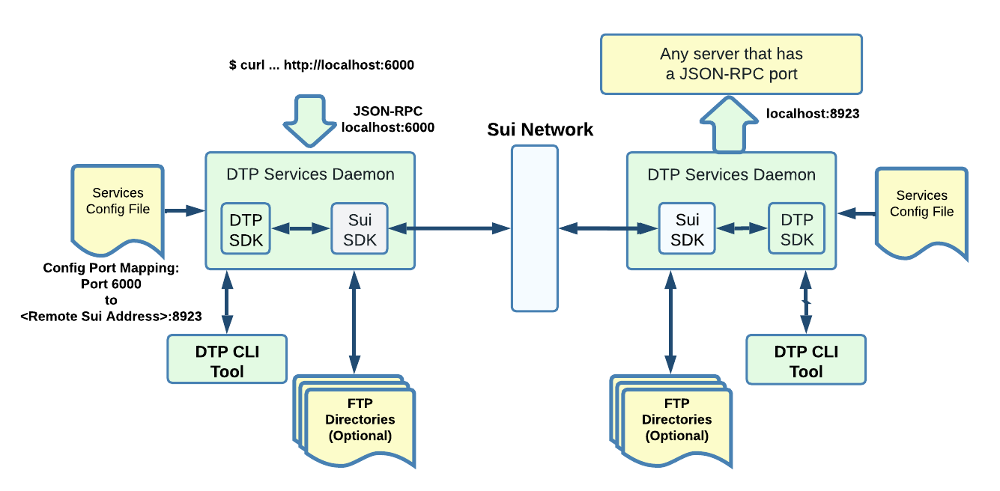

# Installation

### Local setup for Rust-Apps only development  (Plan for early 2023)

Allows to test data exchange between two local Rust apps on the same development machine.\

<figure><figcaption></figcaption></figure>

The Sui network is a **local instance**. It comes with some prefunded accounts for convenience and automation of your tests.\

## Setup with DTP Service Daemons (Plan for April 2023)

Another type of deployment will run a "DTP Services Daemon". The daemon will simplify greatly many use cases.

The daemon provides the bridging to various local applications. A Services Config files specify the features to be enabled and various TCP or UDP port mapping when applicable.\
\
As an example, this is a setup with only the built-in "File Server" service configured:

<figure><figcaption></figcaption></figure>

\
The "dtp" CLI tool communicates with the local daemon to conveniently perform file server operations. Example to copy a file to a remote location:\
&#x20;   $ dtp cp \<local pathname> \<remote Sui Node address + pathname>"\
\
This is another example where cURL communicates with a remote server through DTP:

<figure><figcaption></figcaption></figure>

At first, the config port mapping will need to be hand coded in the config file, but a more flexible solution will eventually be implemented.\
\
(Note: This remote JSON-RPC feature is planned for \~End of August 2023)\
