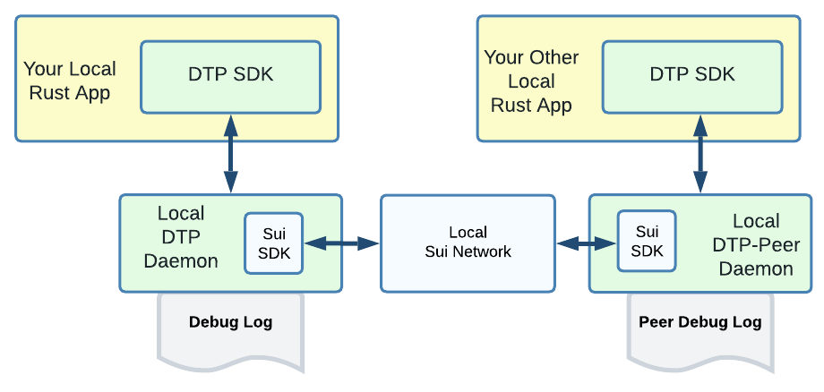

# Installation

### Setup for Rust App Development  (All Local)

Allows to test data exchange between two local apps on the same development machine.

<figure><figcaption>
All Local Development Setup
</figcaption></figure>

The Sui network is a **local instance** running on the same machine. It comes with some prefunded accounts for convenience and automation of your tests.
