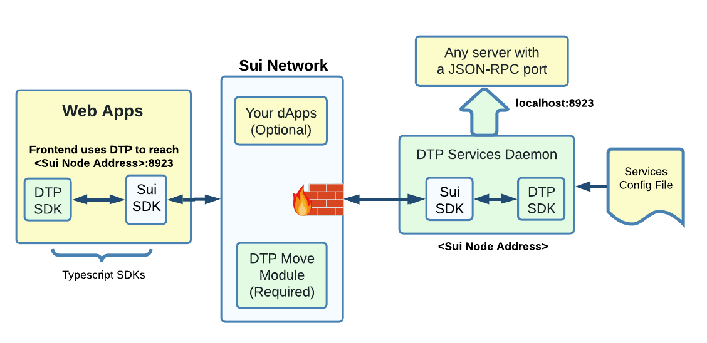

# JSON-RPC Firewall

Use DTP to protect a backend API from DDoS.\
\
Firewall protection is done on the Sui network, even before any traffic reaches the server.\
\
Senders pays all fee to create connections and send traffic.\
\
The server IP address is known only to the Sui nodes.\

<figure><figcaption></figcaption></figure>

\
