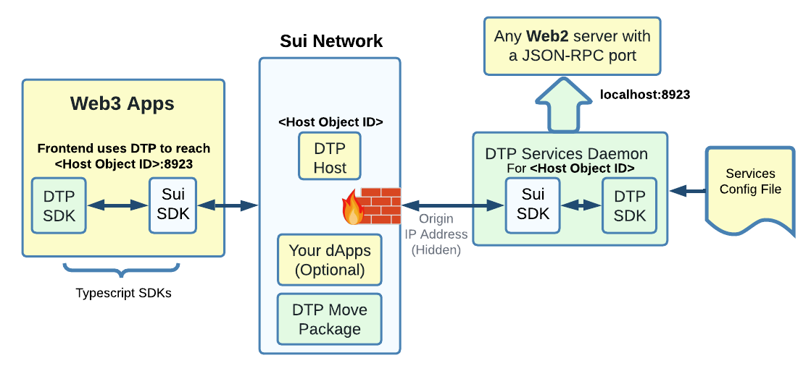

# JSON-RPC Firewall

In this example, a Web3 application access a Web2 server providing a JSON-RPC API to its customer. 

One of the goal is to protect the Web2 server from DDoS attack, in particular, hide its IP address.

<figure markdown></figure>

A DTP "Services Daemon" run as a standard TCP/IP proxy on the same machine as the web2 server.

The firewall is executed on the Sui network on all Web3 DTP connection creation and incoming traffic. Its smart gas cost is mostly covered by the sender/attacker and the protection occurs before anything touch the Web2 server. Consequently, an attack would be costly and mostly futile.

The server IP address is visible only to the Sui nodes (not to the Web3 users on the other side of the Sui network). This is not perfect, but the server owner can control its Sui node partners (in similar way that one choose to, say, trust a reputable company such as Cloudflare).

Everything in green and blue is provided by DTP and the Sui infrastructure respectively. The application developer provides only what is shown in yellow.

In this example the Web3 application contact the hidden/origin web2 server using the `#!Rust <Host Object ID>`:8923 address and DTP takes care of the safe data transfer.

!!! tip "Work-In-Progress... there is more to it... such as mitigation with dynamic `#!Rust <Host ObjectID>` to more than one origin IP mapping"