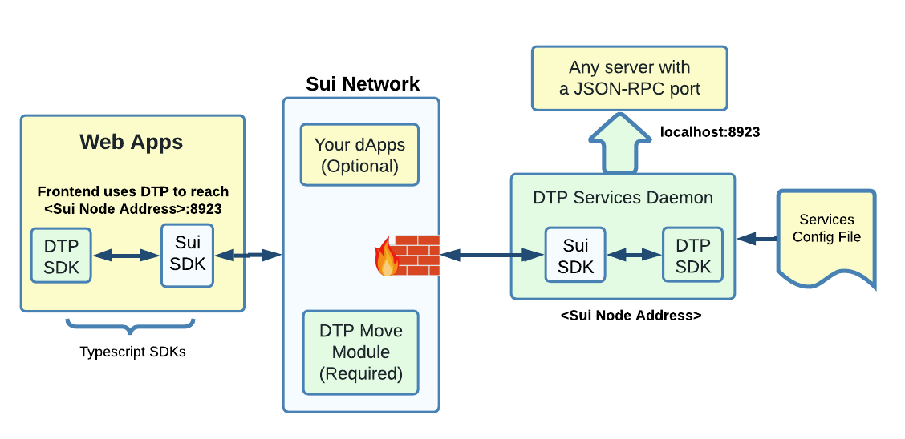

# JSON-RPC Firewall

Use DTP to protect a backend API from DDoS.\
\
The firewall is executed on all connection creation and incoming traffic, thus its gas cost is covered by the sender/attacker.\
\
Protection is done on the Sui network, even before any traffic reaches the server.\
\
The server IP address is visible only to the Sui nodes (not to the users on the other side of the Sui network).

<figure><figcaption></figcaption></figure>

Everything in green and blue is provided by DTP/Sui, the application developer provides what is shown in yellow.\
\
The example shows how to reach a server at port 8923, but any port can be configured and more than one service can be provided at the same \<Sui node address>.\