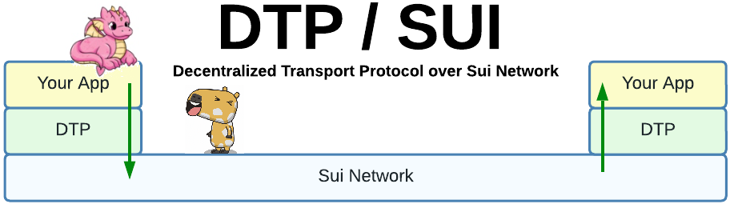
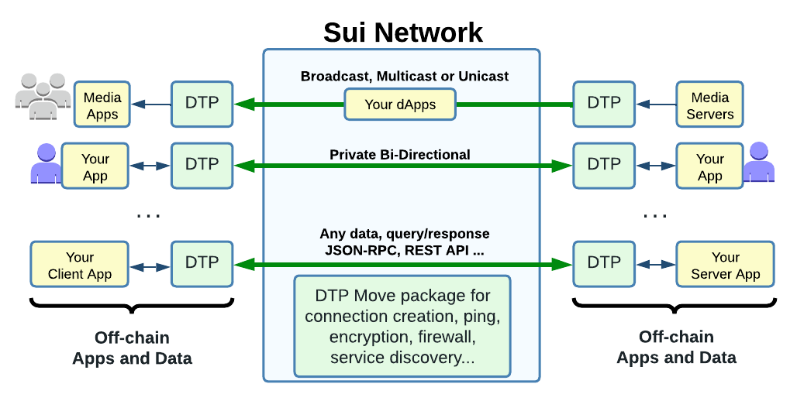
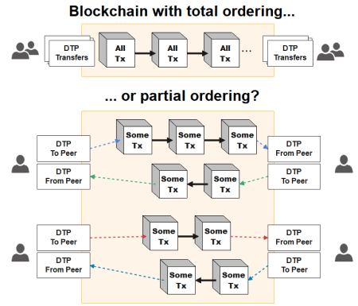

---
hide:
  - navigation
  - toc
---
<figure markdown>
  
</figure>
<h1 align="center">For when you need some <b>web2</b> on the <b>web3</b> playground</h1>

-   :material-circle-opacity:{ .lg .middle } __Create hybrid dApps__

    ---

    Decentralized connection control, metering and crypto-economics 
    <b>&nbsp;&nbsp;&nbsp;&nbsp;&nbsp;&nbsp;&nbsp;&nbsp;&nbsp;+</b>
     Your existing off-chain service and data.

-   :shield:{ .lg .middle } __Security & DDoS Protection__

    ---

    * Scalable firewall built-in! Stop DDoS attacks even before it reaches your servers.
    * Keep your Web2 server IP hidden (visible only to Sui node operator).

    [:octicons-arrow-right-24: More Info...](#)

-   :simple-letsencrypt:{ .lg .middle } __Privacy & Authenticity__

    ---

    * On-chain secret exchanges. DTP always encrypt end-to-end. 
    * key/certificate installation on web3 apps from centralized servers.
    * Authenticity with signed data transfer.

-   :free:{ .lg .middle } __Open-Source__

    ---

    * From developers for developers. No Token, middlemen, commission or dev fee.
    * Only costs is the minimal Sui gas required for smart contracts execution.
  
    [:octicons-arrow-right-24: Check the FAQ...](#)

-   :fontawesome-solid-network-wired:{ .lg .middle } __High Availability__

    ---
    
    * You can configure DTP to automate failover and/or load balancing among your backend servers, then let the L1 network itself maintain access to the service 24/7!

    * Your web2 service might benefit of the censorship resistance quality of a decentralized L1 network.

-   :material-bank-check:{ .lg .middle } __Safe and Fair Hybrid Escrow__

    ---
    
    * Develop new fair Tokenomics on top of Web2: Pay per request, per byte, per RPC call etc...
    
    * DTP has built-in "Response Fee Escrow" to prevent query requesters to perform financial attacks against a company/server.

    [:octicons-arrow-right-24: See Ping example...](#)

<figure markdown>

</figure>

---

{ align=left }

<b> Why Sui and not blockchain 'x' ?</b> 
SUI has good finality latency stability (low jitter) and network scalability (maintains per connectin throughput regardless of total load). 

Sui architecture provides two type of transactions:

* Simple Transaction with sub-second finality for data plane transfer (See "partial ordering" illustration). This allows fast async/parallel transmission.

* Narwhal/Bullshark consensus with 2-3 seconds finality used for slower control plane synchronization, like escrow services, reconfiguration, connection creation,etc...

With its dual-type of transactions with the proper set of qualities, Sui makes practical the implementation of common data + control plane design found in IP networks ( [Cloudflare explains it well](https://www.cloudflare.com/learning/network-layer/what-is-the-control-plane/) ).
 
See [How Sui Differs from Other Blockchains?](https://docs.sui.io/learn/sui-compared)

Why not simply use the good old, faster and free internet?

Join the [Discord community](https://discord.gg/Erb6SwsVbH) and let's talk about it!

