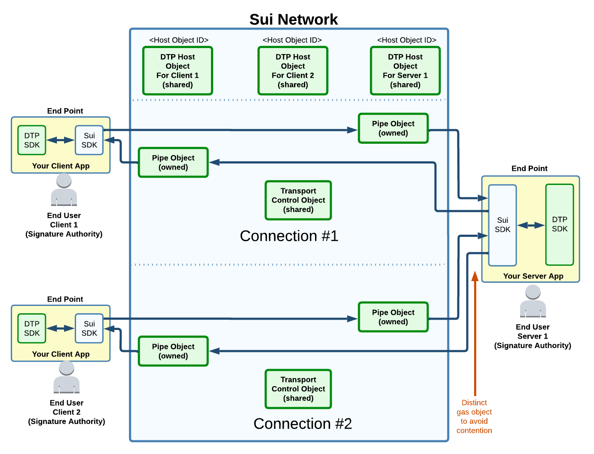
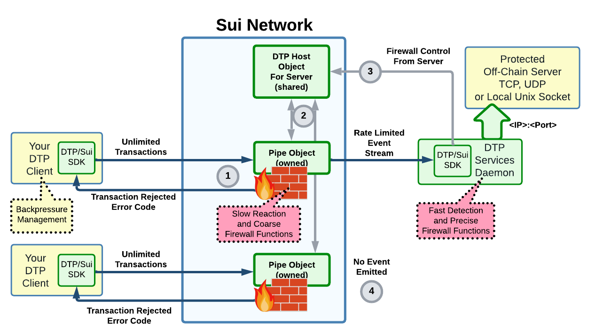
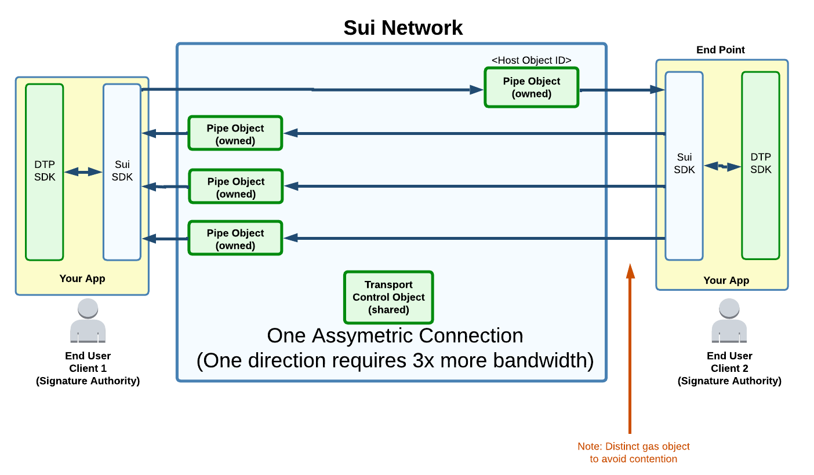
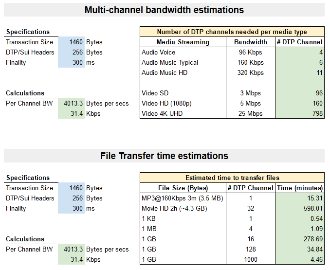
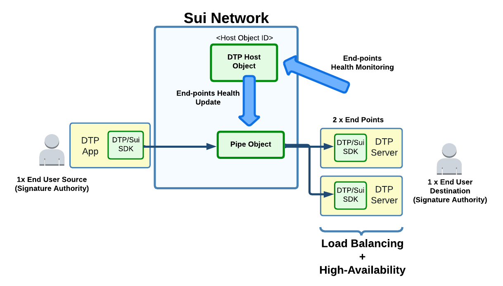
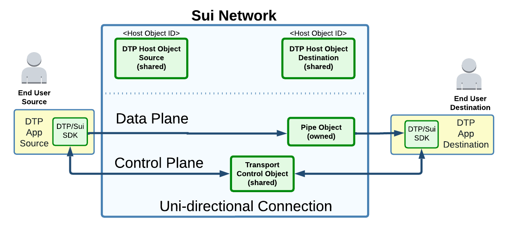
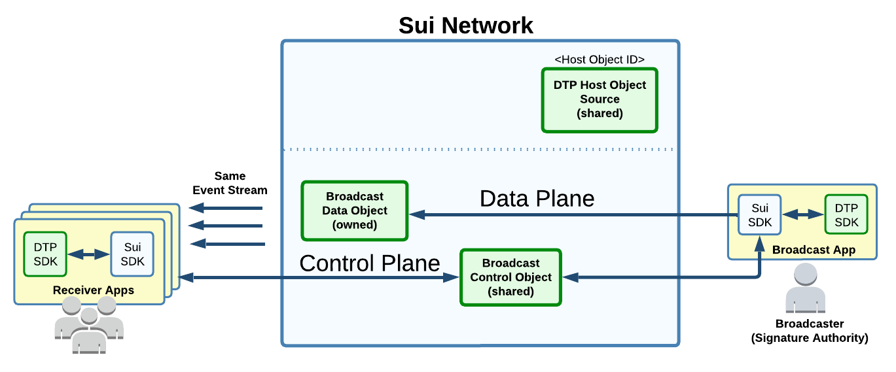

## Target Audience

Developers should first read the API they intend to use.

This document is for developers curious about DTP inner works.

## At high level, how is the Sui Network used?

Sui owned objects are used for unidirectional data transfer with sub-second latency (See [Simple Transaction](https://docs.sui.io/devnet/learn/how-sui-works#simple-transactions) in Sui docs).

Data Ingress: A data stream is sliced into transactions (txns) and added to the Sui network. The txns are targeted to a destination Pipe (owned object).

Data egress: The data "exit" the network through event streams (emitted by the txns being received at the destination Pipe). The transmitted data can be "observed" by any users, but decoded only by the ones having the decryption key.

The receiving end DTP SDK re-assembles the txns into the original data stream. The stream is then forwarded to the intended end-user (a TCP server, a Rust application layer above etc...).

Slower transactions (Sui consensus) are used for most "control plane" synchronizations.

 
## DTP Glossary

<figure markdown></figure>

**Client**: An application that initiate a connection.

**Connection:** One connection allows exchanging data between two applications. The applications are localized by their Host object on the Sui network. A connection will start to exchange data only after a Transport Control and one or two Pipe objects are created (for uni or bidirectional transfer respectively).

**Host Object**: Any signature authority that want to transfer data must create its own Host object. This is a Sui shared object involved in many control plane transactions (e.g. creation of a connection). It allows to configure the services (and SLA) that are to be provided, the lifecycle of its associated connections and control the firewall.

**Objects:** Usually refer to Sui objects (See [Sui Docs](https://docs.sui.io/build/programming-with-objects))

**Pipe Object**:All off-chain data exchange involves an intermediate object on the Sui network. This object is the Pipe. It is owned by the sender of the data, and have its event stream observed by the receiver(s). A Pipe is loosely coupled to a Transport or Broadcast Control object for synchronization.

**Server**: Off-chain process intended to respond to client requests.

**Service Level Agreement (SLA)**: Specify the costs, limitations and some behaviors for a service provided by a Host object. Example would be "sent data can be deleted from network storage after 48 hours (2 epochs)". The client signifies that it agrees to an SLA at the time the connection to the node is initiated. The SLA specs are such that DTP can enforce the agreement fairly to all parties.

**Transport Control Object**: Variables and state machines that exists for the lifetime of a single connection. This is a Sui shared object.

## Firewall

<figure markdown></figure>

(1) Gas cost of processing incoming traffic is paid by the sender. That includes connection creation cost and running the firewall at the Pipe Object. Most abuse can therefore be neutralized without requiring any processing/cost from the Server.

Firewall functionality also includes back pressure management to minimize initiating/paying for transactions while the server is already known offline or too busy.

(2) Optionally, the DTP Node Host object gather statistics from all its Pipe objects and adjust the rate limiting rules. This may happen when the Server detects excessive incoming traffic. The gas cost for these likely rare adjustments is to be handled by the Server. (Note: This is a **logical** representation. More details will follow on how this is implemented such that Pipe objects are not involved with slower consensus transactions).

(3) The server configure the firewall and does a periodical heartbeat using its shared DTP Host object. The server may also do some fast detection and control on the firewall (TBD).

(4) When a transaction has no-effect because of the firewall, there is no event emitted (and sender is informed that the transaction was executed, but blocked by the firewall). Therefore, the Server is not impacted.

## Multi-Channel Connection

Media byte streams are ineviteably divided into transaction "block" at some point. Even with a fast finality, the bandwidth is limited by the maximum transaction size and their serialization as allowed by the L1 network (e.g. one simple transaction per object and gas coin at the time).

Therefore, to support high bandwidth, it might be needed to perform multiple transaction in parallel for a single connection transfer. These transaction flows through independent DTP channels.

Most of the complexity is handled off-chain by DTP when dividing and re-assembling the transactions into a data stream:

<figure markdown></figure>

**Will this be practical?**
There is a lot of cost/performance unknowns with both Sui network and DTP that will probably persist through 2023. DTP architecture supports media streaming, but it remains to be seen how practical it will be.

Gas might be expensive and there is some potential limitations about how much Sui fullnodes could scale on a viral broadcast (problem at egress of the network, not with the consensus performance itself).

Light data streaming (<20 Kbps) very likely to be supported and be useful within 2023.

Regardless of practicality, support for multi-channel will be at least useful for demo/stress load on a test network.

Some estimations (See on [Google Sheet](https://docs.google.com/spreadsheets/d/1zBrB1ifhPpnLlsDr6nBN\_N55Kkw9hX06a7EVUpogyn4/edit?usp=sharing)):

<figure markdown>
<mark style="color:red;">(Note: Numbers are best guess as of 11/21/22. Will be revised from time to time)</mark>
</figure>

## High-Availability and Load Balancing

<figure markdown>
Forwarding decision made by Pipe object when multiple end-points (servers) 
</figure>

Off-chain servers can share the incoming load or be each other's fallback for high-availability.

Unlike traditional network, the data is not physically pushed toward a server. Instead, the data remains on the network and an event is emitted about who should "pull it".

It is an off-chain responsibility for the application to subscribe to their respective event stream (with proper identifier filtering) and normally retrieve only its assigned data (this change in some recovery scenario).

Configuration of the end-points and health of the servers is managed through the DTP node, which in turn updates all its pipes and transport control objects.

DTP will hide the high complexity of many race conditions (assignment to a server that died) and connection migrations among all end-points belonging to the same Node.

## Uni-directional Transfer
Similar to bi-directionals, but with a single Pipe object for data plane to minimize cost/complexity. Control plane still bi-directional (e.g. for encryption handshake).

<figure markdown>
Uni-Directional Data Transfer
</figure>

## Public Broadcasting

Similar to unidirectional, but without encryption and using Broadcast objects instead of a Pipe&Transport control.

<figure markdown>
Broadcasting Specific Objects
</figure>

Broadcasters may require some different crypto-economic capability. Examples:

* A live broadcast is wasteful if there is no one listening... one option will be to let DTP stop stream until there are enough fund from listeners to cover, say, the production cost of the next 1 minute. DTP would handle the automatic "on air" logic and fairly spread the cost among the contributors.
* Listener may choose to tip a live broadcaster (for special requests?).

There are also some technical challenges particular to broadcasting (See [Future Work](future_work.md#broadcasting-challenges)).