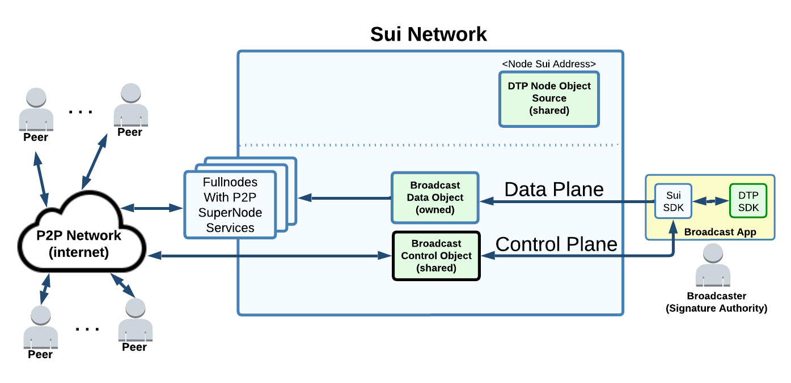

# Future Work

## **Broadcasting Challenges**

Data broadcasting will put pressure on fullnodes WebSocket event streaming services.

Fullnodes may have low economic incentive to support such high bandwidth services.

The architecture should scale to match the audience size.

Consequently, one possible **long term** solution is for DTP/Sui to provide only the crypto-economic services and then leave the burden of broadcasting to a public peer-to-peer network.

<figure markdown></figure>

Each peer is running a DTP app for direct connection to the Sui network (for control plane). The complexity of the data plane transiting through a peer-to-peer network should be hidden to the end-users (Peers).&#x20;

The use of P2P or not remains irrelevant to the broadcaster which always interface directly to the Sui network.

## Data Deletion

Once the data is confirmed consumed by the receiver(s), then it can be deleted on the L1 network to recover some storage fee 
--> Revisit the design needed here once Sui implements Storage fund.

The sender of the data can opt out from automated deletion and assume the full storage cost.

Automated deletion is controlled by DTP to provide a fair time for the receiver(s) to consume the data and can be fine tuned through the sender service level agreement (SLA).

The SLAs are published by the server (in its Node object) and one is selected by the client at the time of the connection being established.

## Data Consumption Confirmation

TCP protocol includes acknowledgment of L4 delivery to the destination, but without guarantee of being consumed by the application (requires additional protocol at layer 7).

DTP layer supports both; a confirmation of the data being available on the L1 network (TCP delivery equivalent) and optional confirmation of the client consuming the data (L7 protocol equivalent).

Example of use would be to integrate in the dApps the verification that the data was persisted off-chain by the destination. There is no verification that the destination is honest, but this would be used in context where it would be in the destination best interest to act honestly.

## **Encrypted Broadcasting**

For now, broadcast are assumed to be always public and non-encrypted.

Allowing encryption may allow alternative economic model (similar to cable and/or streaming subscription services[^1]), but this is challenging and piracy can (at best) only be mitigated[^2].

Only the user with the decryption key would be able to make sense of the data. More research to be done about how DTP could implement this feature.

[^1]: Wikipedia [Broadcast Encryption](https://en.wikipedia.org/wiki/Broadcast\_encryption)

[^2]: Wikipedia [Multicast Encryption](https://en.wikipedia.org/wiki/Multicast\_encryption)