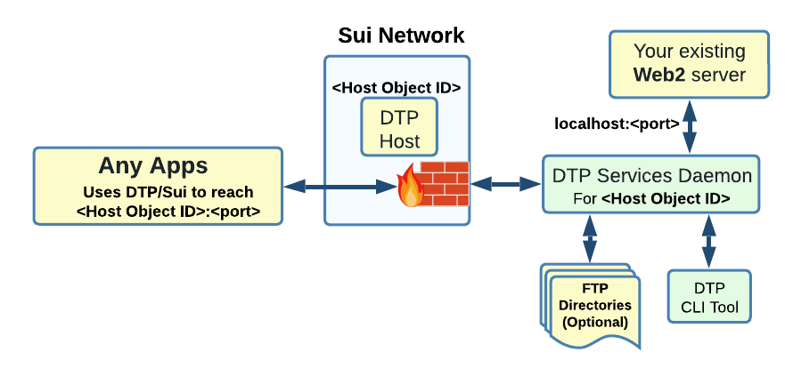

## Choice 1 of 3: Simplified DTP Services Deployment

 Choose this setup if you only need one of the following feature:

  * (Optional) Make your server API accessible on the Sui network (e.g. REST, JSON-RPC etc...)

  * (Optional) Make a local directory content accessible on the Sui network (be a "file server")

  * (Optional) Allow other user on the network to discover and ping your server.  

<figure markdown></figure>

!!! tip "Work-in-progress. Simplified deployment not yet available. For now, the functionality is available as part of the more complex Rust development setup"

## Choice 2 of 3: DTP Rust Development Setup

Choose this setup if you need any of these:

  * Create a Sui Move package (with or without DTP)
  
  * Create your own Rust application using DTP and/or Sui Rust SDK.  

Includes the Sui framework itself, the DTP Service Daemon and all the DTP scripts to facilitate local and devnet testing.
[:octicons-arrow-right-24: Go to Rust Setup ...](setup/../rust.md)

## Choice 3 of 3: DTP Typescript SDK (NPM Package)

!!! tip "Typescript development not yet started. Schedule may depend on community/foundation demand"
