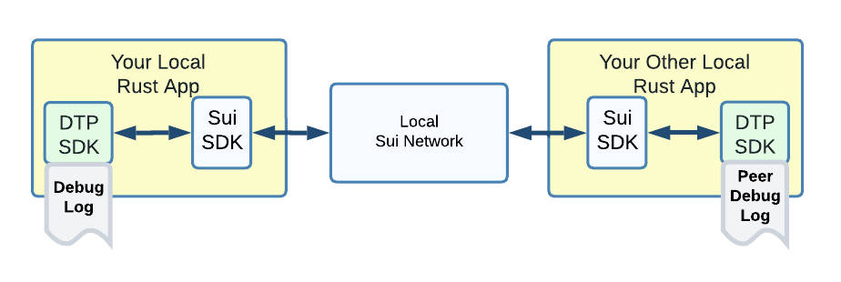
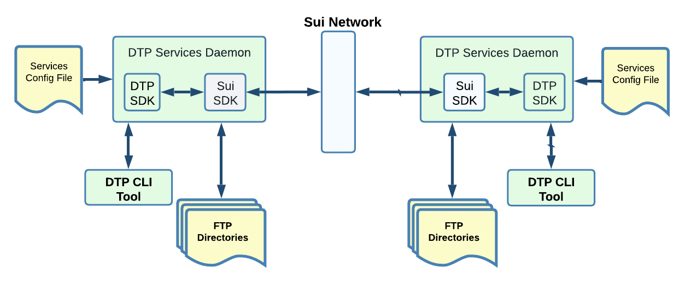
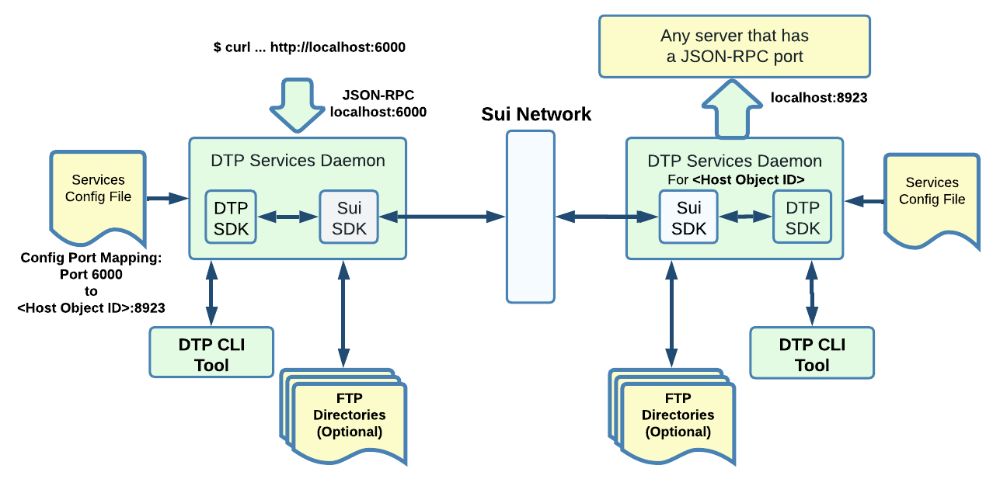

!!! tip "This page need some serious clean-up... see github for the next few days..."

DTP provides many scripts to make Sui hybrid app development easy.

Example includes re-starting your localnet with one command with always the same fund in the same accounts, automate your Move package integration test etc...

SUI and DTP SDK co-exists independently in same application, consequently, this installation still works well for Sui development even when not using DTP.

Typescript and Rust Setup

<some directory>
     |-- ...        <-- Your code can be anywhere *outside* the DTP directories
     |-- dtp        <-- The single cloned DTP Repositories
     |-- dtp-dev    <-- The working directory created and used by DTP

# Installation

### Localnet setup for Rust-Apps only development  (Plan for early 2023)

Allows to test data exchange between two local Rust apps on the same development machine.

<figure><figcaption></figcaption></figure>

The Sui network is a **localnet instance**. It comes with prefunded client accounts for convenience and automation of your tests.\
\
You can have the localnet running minutes after cloning the DTP repo. \
\
See the 'init-localnet' script:\
&#x20;            [https://github.com/mario4tier/dtp/tree/main/script](https://github.com/mario4tier/dtp/tree/main/script)

## Setup with the DTP Services Daemon (Plan for April 2023)

A common type of deployment will run the "DTP Services Daemon". This setup simplifies many use cases.

The daemon provides the bridging to various local applications. A Services Config file specify the enabled features and various port mapping (when applicable).\
\
As an example, this is the built-in "File Server":

<figure><figcaption></figcaption></figure>

The "dtp" CLI tool is the user interface. It communicates with the local daemon to perform file server operations. \
\
Example to copy a file to a remote location:\
&#x20;   $ dtp cp \<local pathname> \<remote Sui Host Object ID + pathname>"\
\
Another example with cURL reaching a remote object ID through DTP:

<figure><figcaption></figcaption></figure>

At first, the port mapping will need to be manually specified in the config file, but a more flexible solution will eventually be implemented.\
\
(Note: This config port mapping feature is planned for \~End of August 2023)\